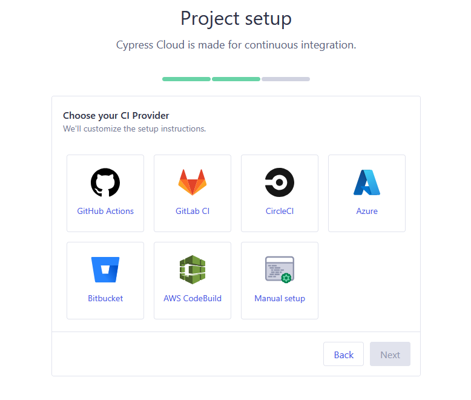

# Cypress cloud

Con cloud podemos ratrear de manera más efectiva nuestras automatizaciones, con el fin de sabes muchas mas información relavante de esta.


Para tener Cloud es muy sencillo:

### 1. Iniciar cloud

Al momento de ejecutar cypress, debemos iniciar sesión con cloud.


Desde aquí creamos nuestra cuenta cloud en caso de no tenerla, y podemos.

---

### 2. Proyecto cloud

Ahora desde cypress cloud debemos crear(integrar) nuestro proyecto de automatización, para ello primero creamos un nuevo proyecto.


---

### 3. Agregar ID de proyecto

Una vez creado el proyecto debemos agregar el ID que nos de cypress cloud a nuestro proyecto de automatización, en nuestro archivo "config" (cypress/cypress.config.js).

```javascript
    module.exports = {
        projectId: "o7qpdw",
        // ...rest of the Cypress project config
    }
```

---

### 4. Configurar nuestro CI

Con nuestro proyecto identificado, ahora debemos seleccionar el proveedor CI de este.



Dependiendo de la opción seleccionada, puede que la configuración varie un poco, para este proyecto se realizará esta por medio de "GitHub Actions", para ello debemos conectar nuestro github con nuestro cloud.


Luego debemos realizar las 2 solicitudes del cloud:

### **1. Crear nuestra llave**
Para ello desde nueestro proyecto de github, en lo "Settings" debemos ingresa a "Secrets and variables" para luego pulsar sobre "Actions" y Desde aquí podremo crear un nuevo secret con la configuración de cypress cloud.

#### Condiguración Cloud


#### Secret github


### **2. Agregar .yml de acciones**

debemos crear en nuestro proyecto cypress el archivo .yml que nos da el cloud.


Luego de esto se debe realizar un "push" para que la accion guardada se ejecute de forma correcta.